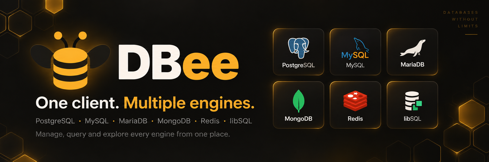
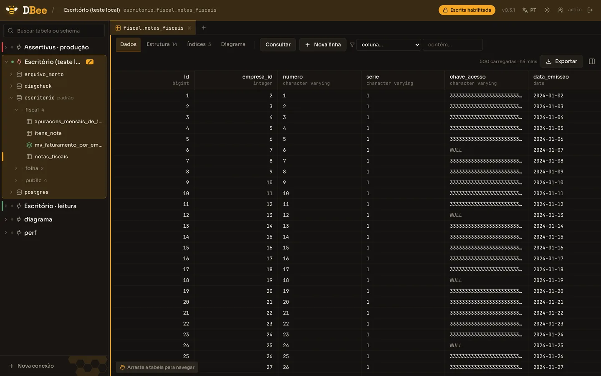
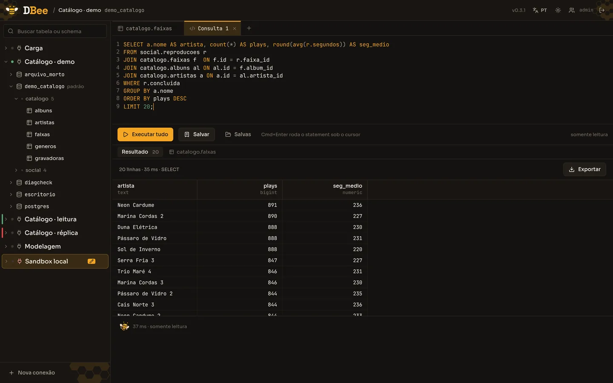
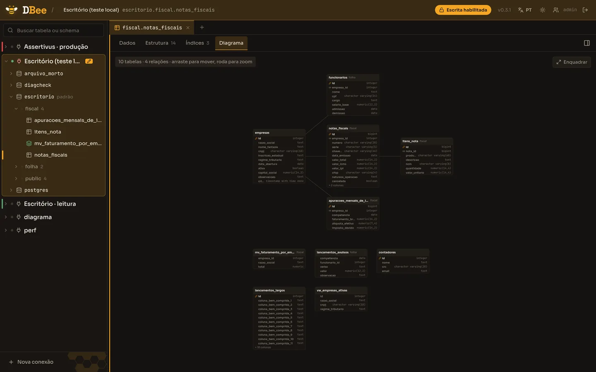

<p align="center">
  
</p>

<h1 align="center">DBee</h1>

<p align="center">
  <strong>Cliente PostgreSQL web, self-hosted.</strong><br>
  Um container, sem agente, sem SaaS — e read-only até você dizer o contrário.
</p>

<p align="center">
  <a href="https://github.com/joaoviitorsx/DBee/releases/latest"></a>
  
  
  
</p>

---

O DBee nasceu porque abrir um cliente pesado para responder "quantas notas essa
empresa emitiu em março?" é caro demais, e mandar o banco do cliente para uma
ferramenta SaaS não é uma opção. Ele roda na sua infraestrutura, o time acessa
pelo navegador, e **nenhuma escrita acontece por acidente**: toda transação
nasce `BEGIN READ ONLY`, e escrever exige ligar a conexão *e* a permissão da
pessoa.

Está em produção diária num escritório contábil desde a v0.1.

<p align="center">
  
</p>
<p align="center"><sub>Grade virtualizada — 100 mil linhas sem travar, paginação por keyset, arraste para navegar.</sub></p>

<table>
<tr>
<td width="50%"></td>
<td width="50%"></td>
</tr>
<tr>
<td><sub><strong>Editor SQL</strong> — autocomplete de tabela e coluna, vários statements por execução, tempo de cada um, erro do Postgres inteiro (com a posição destacada).</sub></td>
<td><sub><strong>Diagrama ERD</strong> — gerado do catálogo, layout em camadas pelas FKs. Tabelas sem relação vão para uma grade abaixo, em vez de virar uma coluna de 13 mil pixels.</sub></td>
</tr>
</table>

## O que ele faz

**Explorar**
- Árvore de conexões → bancos → schemas → tabelas, com busca
- Grade virtualizada com ordenação, filtro e paginação por keyset
- Estrutura, índices e diagrama ERD por tabela
- Salto por FK: clicar numa chave estrangeira abre a tabela referenciada já filtrada
- Visão do cluster: bancos, processos ativos (`pg_stat_activity`) e auditoria

**Consultar**
- Editor SQL com autocomplete alimentado pelo catálogo real
- Vários statements por execução, cada um com seu resultado e tempo
- Cancelamento de query em andamento
- Queries salvas e histórico pesquisável

**Escrever — quando você deixa**
- Read-only por padrão: `BEGIN READ ONLY` na transação, não um `SET` que a
  sessão pode desfazer
- Editar célula, inserir e excluir linha, **sempre com o SQL na tela antes de
  aplicar**
- Concorrência otimista: se outra pessoa mexeu na linha entre a leitura e o
  clique, a operação aborta em vez de sobrescrever
- Cardinalidade provada dentro da transação — diferente de 1 linha reverte

**Exportar**
- CSV, TSV, JSON, NDJSON e SQL, em stream (a memória não cresce com a tabela)
- Várias tabelas de uma vez, num `.zip`, tudo do mesmo instante consistente
- Os mesmos filtros e ordenação da tela — o arquivo é o que você está vendo

**Operar**
- Contas individuais com papéis, e permissão **por conexão**
- Auditoria de toda escrita: SQL literal, quem fez e quando
- PT/EN, tema claro/escuro, responsivo de 320 px para cima
- Aviso de versão nova e atualização por webhook do orquestrador

## Subir em três passos

```bash
# 1. O segredo que cifra as senhas das conexões. Guarde num cofre.
openssl rand -hex 32

# 2. Suba o container (sem -p: veja Segurança)
docker run -d --name dbee \
  -e APP_SECRET="<o hex do passo 1>" \
  -v dbee-data:/data \
  ghcr.io/joaoviitorsx/dbee:latest

# 3. Leia o token do primeiro acesso
docker exec dbee cat /data/setup-token
```

Abra o DBee pelo IP da tailnet ou pelo proxy interno, informe o token e escolha
seu usuário e senha. O token é apagado do volume nesse instante — **nenhuma
senha é gerada nem impressa em log**.

> ### ⚠️ Perder o `APP_SECRET` **ou** o volume `/data` = conexões perdidas
>
> As senhas das conexões são cifradas com uma chave derivada do `APP_SECRET` e
> de um salt que vive **dentro do SQLite**, no volume. São dois pontos únicos de
> falha, e não há recuperação — só recadastrar tudo.
>
> Guarde o `APP_SECRET` no gerenciador de segredos e **declare o volume**.

Deploy no Dokploy, checklist de primeira subida e as regras de firewall estão em
[`docs/operacao.md`](docs/operacao.md).

## Variáveis de ambiente

| Variável | Obrigatória | Para quê |
|---|---|---|
| `APP_SECRET` | **em produção, sim** | Deriva a chave AES-256-GCM que cifra as senhas das conexões. O boot **aborta** se faltar com `NODE_ENV=production`. Em dev usa um segredo fixo e avisa alto. |
| `DBEE_DATA_DIR` | não | Onde ficam o SQLite e o salt de cifra. Default `/data`. **Precisa de volume persistente.** |
| `PORT` | não | Porta do servidor. Default `3001`. Valor inválido aborta o boot. |
| `DBEE_CA_CERT` | não | CA em PEM para `sslmode=verify-full` contra um CA privado. Vazio é tratado como ausente. |
| `DBEE_COOKIE_SECURE` | não | Marca o cookie de sessão como `Secure`. Sem a env, segue o protocolo da requisição. Só defina `true` quando o **TLS termina no proxy**. |

> Não existem `ADMIN_PASSWORD` nem `DOKPLOY_DEPLOY_WEBHOOK`: a primeira conta
> nasce pela tela de setup, e a URL de deploy é colada uma vez na própria
> interface, ficando cifrada no SQLite.

## Segurança

O app **não é exposto à internet**. Roda como usuário não-root (uid 10001) e
**não** monta o socket do Docker. O acesso é pelo proxy interno (Traefik do
Dokploy) ou por uma porta bindada no IP da tailnet — nunca em `0.0.0.0`.

A proteção contra escrita acidental é o modo da transação, declarado no próprio
`BEGIN` — não um parser de SQL, que sempre tem um caso que escapa. Ela é
proteção contra o acidente comum, **não** caixa de contenção contra um papel
privilegiado: num superusuário, `COPY … TO PROGRAM` continua executando comando
no host do Postgres. O DBee detecta o papel privilegiado ao testar a conexão e
avisa. Como criar papéis restritos está em
[`docs/papeis-postgres.md`](docs/papeis-postgres.md).

## Desenvolvimento

```bash
bun install
bun run dev          # server :3001 + web :5173
bun run typecheck
bun run lint
bun test
bun run build        # web (Vite) + binário do server (bun build --compile)
docker build -t dbee .
```

Stack: **Bun + Elysia + React**, TypeScript strict, TypeBox nas rotas, Eden
Treaty ligando os dois lados, `bun:sqlite` para o estado local. Sem ORM, sem
módulo nativo — o binário tem que compilar com `bun build --compile`.

## Documentação

| | |
|---|---|
| [`docs/operacao.md`](docs/operacao.md) | Deploy, checklist de subida e firewall |
| [`docs/arquitetura.md`](docs/arquitetura.md) | Estrutura de pastas e o caminho do erro do Postgres até a tela |
| [`docs/design-system.md`](docs/design-system.md) | Paleta, tipografia e semântica de cor |
| [`docs/papeis-postgres.md`](docs/papeis-postgres.md) | SQL para papéis restritos no banco do cliente |
| [`CHANGELOG.md`](CHANGELOG.md) | Histórico de versões |
