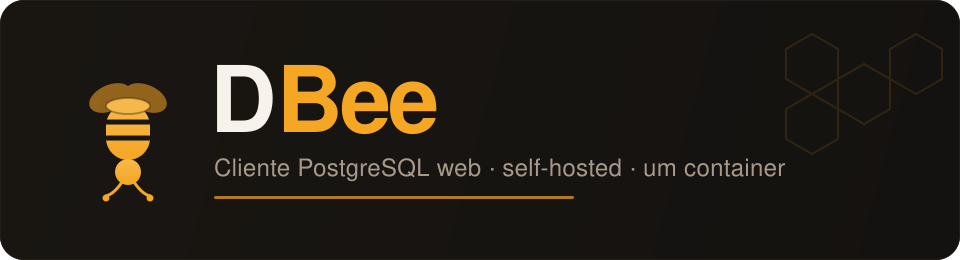

<p align="center">
  
</p>

# DBee

Cliente PostgreSQL web, self-hosted, para uso diário em produção. Bun + Elysia +
React, um único container.

O que faz hoje: autenticação com sessão e usuários individuais, CRUD de conexões
com senha cifrada, árvore de schema navegável, editor SQL com autocomplete e
execução read-only, grid virtualizado com paginação por keyset, export
CSV/JSON/NDJSON em stream, diagrama ERD, histórico e auditoria pesquisável,
interface em PT/EN. Read-only por padrão — escrita é opt-in por conexão: edição
de célula, INSERT e DELETE de linha com diff antes de aplicar e concorrência
otimista, além do cancelamento de query em execução.

## Instalar e rodar

O DBee sobe como um container. O caminho abaixo é para um servidor próprio com
Docker; para o Dokploy, veja a seção seguinte.

### 1. Gere o `APP_SECRET`

Ele deriva a chave que cifra as senhas das conexões. **Gere uma vez e guarde
num gerenciador de segredos** — perdê-lo torna as conexões ilegíveis (ver o
aviso abaixo).

```bash
openssl rand -hex 32
```

### 2. Puxe a imagem

A imagem é publicada no GHCR a cada tag. O **pacote é tornado público** após o
primeiro publish — a imagem carrega só o binário compilado e os assets, sem
segredo — então o pull não precisa de autenticação:

```bash
docker pull ghcr.io/joaoviitorsx/dbee:latest
```

O pacote nasce **privado** por padrão no GHCR; torne-o público uma vez, em
`github.com/users/joaoviitorsx/packages` → o pacote `dbee` → *Package settings* →
*Change visibility*. Evita cadastrar um PAT permanente no Dokploy para cada
redeploy.

> **Alternativa — manter privado.** Se preferir não expor o pacote, deixe-o
> privado e autentique antes do pull com um PAT com escopo `read:packages` (no
> Dokploy, como *registry credential*):
> ```bash
> echo "$GITHUB_TOKEN" | docker login ghcr.io -u joaoviitorsx --password-stdin
> docker pull ghcr.io/joaoviitorsx/dbee:latest
> ```

### 3. Suba

```bash
docker run -d --name dbee \
  -e APP_SECRET="<o hex de 32 bytes do passo 1>" \
  -v dbee-data:/data \
  ghcr.io/joaoviitorsx/dbee:latest
```

Sem `-p`: o DBee **não deve** ter porta publicada na internet (ver Segurança). O
acesso é pela tailnet ou por um proxy interno.

### 4. Leia o token de setup do volume

No primeiro boot, sem nenhuma conta, o DBee entra em **modo setup**: grava um
token aleatório em `/data/setup-token` e loga só o **caminho**, nunca o token —
senha em log é senha visível para quem tem o painel. Leia o token do volume:

```bash
docker exec dbee cat /data/setup-token
```

### 5. Crie a primeira conta

Abra o DBee pelo IP da tailnet (`http://100.x.y.z:3001`) ou pelo proxy. A tela de
**primeiro acesso** pede o token que você leu, mais o usuário e a senha que você
escolhe. Ao criar a conta, o token é apagado do volume e você já entra logado —
não há senha gerada nem impressa em lugar nenhum.

## Deploy no Dokploy

Serviço com provider Git apontando para este repo, branch `main`, Compose Path
`deploy/docker-compose.yml`, trigger On Push. O GitHub App do Dokploy precisa de
acesso explícito a este repo. Defina `APP_SECRET` nos secrets do serviço.
Para criar a primeira conta, leia o token de `/data/setup-token` pelo terminal do
serviço no painel do Dokploy (`cat /data/setup-token`) e informe-o na tela de
primeiro acesso.

A imagem é **amd64** (`bun build --target bun-linux-x64`) — o host do Dokploy
precisa ser amd64. Numa VM arm64 o container não sobe.

### Checklist antes de apertar o deploy

Prepare tudo isto **antes** do primeiro deploy — cada item que faltar aparece
como uma falha diferente e obscura:

**Segredos a gerar**
- [ ] `APP_SECRET` — `openssl rand -hex 32`, guardado nos secrets do serviço no
  Dokploy (não em `.env` versionado). É o que cifra as senhas das conexões;
  perdê-lo é irreversível.

**Acessos a conceder**
- [ ] GitHub App do Dokploy com acesso **explícito** a `joaoviitorsx/Dbee` (o
  acesso amplo à conta não basta — conecte o repo no serviço).
- [ ] Credencial de registry no Dokploy para puxar do GHCR: o pacote nasce
  **privado**. Ou um PAT com `read:packages` configurado como registry credential
  no Dokploy, **ou** tornar o pacote público em `github.com/users/joaoviitorsx/
  packages` depois do primeiro publish. Sem isso o pull falha com "denied" — e o
  erro não diz que é permissão de pacote.

**Valores a preencher no painel**
- [ ] `APP_SECRET` no serviço (secret).
- [ ] Domínio/rota do serviço apontando a **porta interna 3001** (ou as labels de
  Traefik do compose — não as duas).
- [ ] Volume nomeado `dbee-data` persistido (já no compose; confirmar que o
  Dokploy não recria sem ele — perder `/data` = perder as conexões).

**Rede**
- [ ] `dokploy-network` externa existe (padrão do Dokploy).
- [ ] Restrição de porta pela tailnet, se publicar porta em vez de usar o Traefik
  (ver Segurança, padrão `DOCKER-USER`).

**Primeira vez que a tag roda o CI**
- [ ] A imagem só é publicada ao empurrar uma tag `vX.Y.Z` (o workflow dispara em
  `v*`). O nome publicado é `ghcr.io/joaoviitorsx/dbee` (o
  `docker/metadata-action` normaliza `github.repository` para minúsculas) — é
  exatamente o que o compose consome.
- [ ] Depois do primeiro publish, conferir que o pacote existe em GHCR e aplicar
  a credencial/visibilidade do item acima antes de mandar o Dokploy puxar.

## Variáveis de ambiente

| Variável | Obrigatória | Para quê |
|---|---|---|
| `APP_SECRET` | **sim, em produção** | Deriva a chave AES-256-GCM que cifra as senhas das conexões. O boot **aborta** se faltar com `NODE_ENV=production`. Em dev usa um segredo fixo e avisa alto. |
| `DBEE_DATA_DIR` | não | Onde ficam o SQLite e o salt de cifra. Default `/data` no container. **Precisa de volume persistente** (ver aviso). |
| `PORT` | não | Porta do servidor. Default `3001`. Valor inválido aborta o boot. |
| `DBEE_CA_CERT` | não | CA em PEM para `sslmode=verify-full` contra um CA privado. Vazio é tratado como ausente (não zera o CA store do sistema). |

> **Não existem `ADMIN_PASSWORD` nem `DOKPLOY_DEPLOY_WEBHOOK`.** Versões antigas
> deste README as citavam; o código não as lê. A primeira conta nasce pela tela
> de setup, com o token de `/data/setup-token` (passos 4–5) — **nenhuma senha é
> gerada nem impressa**. A atualização por webhook e o badge de versão são
> planejados, ainda não implementados — hoje se atualiza publicando uma tag e
> re-deployando.
>
> `DBEE_PUBLIC_DIR` (opcional) aponta o diretório do web estático que o binário
> serve; default `./public` a partir do diretório de trabalho (no container,
> `/app/public`). Em dev o web é servido pelo Vite, não por esta variável.

> ### ⚠️ Perder o `APP_SECRET` **ou** o volume `/data` = conexões perdidas
>
> As senhas das conexões são cifradas com uma chave derivada do `APP_SECRET` e
> de um salt que vive **dentro do SQLite** (em `DBEE_DATA_DIR`, o volume
> `/data`). São **dois** pontos únicos de falha:
>
> - **`APP_SECRET` mudou ou se perdeu** → as conexões ficam ilegíveis em
>   definitivo.
> - **o volume `/data` se perdeu** (recriar o container sem volume nomeado, por
>   exemplo) → perde o salt e o banco: mesmo efeito, mesmo com o `APP_SECRET`
>   certo.
>
> Guarde o `APP_SECRET` no gerenciamento de segredos e **declare o volume**.
> Não há recuperação — só recadastrar tudo.

## Desenvolvimento

```bash
bun install
bun run dev          # server :3001 + web :5173
bun run typecheck
bun run lint
bun test
bun run build        # web (Vite) + binário do server (bun build --compile)
```

## Container, local

```bash
docker build -t dbee .
docker run --rm -e APP_SECRET="$(openssl rand -hex 32)" -v dbee-data:/data dbee
docker exec <container> cat /data/setup-token          # token do primeiro acesso
```

## Segurança

O app **não é exposto à internet**. Roda como usuário não-root (uid 10001), sem
socket do Docker montado. Duas formas de acesso, nunca uma porta pública:

**1. Via Traefik do Dokploy (preferido).** Sem porta publicada; o Traefik alcança
o container pela `dokploy-network` e o domínio é configurado na UI do serviço
apontando a porta interna `3001`. É o que o `deploy/docker-compose.yml` assume.

**2. Porta bindada no IP da tailnet + `DOCKER-USER`.** Se publicar a porta em vez
de usar o Traefik, **bind no IP `100.x` do Tailscale**, nunca em `0.0.0.0`:

```yaml
    ports:
      - "100.x.y.z:3001:3001"   # só o IP da tailnet, nunca 0.0.0.0
```

O bind por si só não basta: o Docker escreve regras de NAT que **furam o UFW**, e
uma publicação em `0.0.0.0` por engano ficaria aberta. O cinto e suspensório é o
mesmo padrão `DOCKER-USER` já aplicado na 3000 e na 15672 — só a interface da
tailnet alcança a 3001, o resto é dropado **antes** do NAT do Docker:

```bash
# Ordem importa: -I insere no topo, então o ACCEPT (inserido por último) fica
# ACIMA do DROP. Tráfego que entra pela tailscale0 é aceito; todo o resto cai.
iptables -I DOCKER-USER -p tcp --dport 3001 -j DROP
iptables -I DOCKER-USER -i tailscale0 -p tcp --dport 3001 -j ACCEPT
```

Persista as regras como já faz para as outras portas (o mesmo `iptables-restore`
/ unit que mantém as regras da 3000 e da 15672). Confirmar depois: de fora da
tailnet, a 3001 não responde; de dentro, sim.

## Documentação

- [`docs/arquitetura.md`](docs/arquitetura.md) — estrutura de pastas e fluxo do erro do Postgres até a UI.
- [`docs/design-system.md`](docs/design-system.md) — paleta, tipografia e semântica de cor.
- [`docs/papeis-postgres.md`](docs/papeis-postgres.md) — SQL para papéis restritos no Postgres do cliente.
- [`CHANGELOG.md`](CHANGELOG.md) — histórico de versões.
